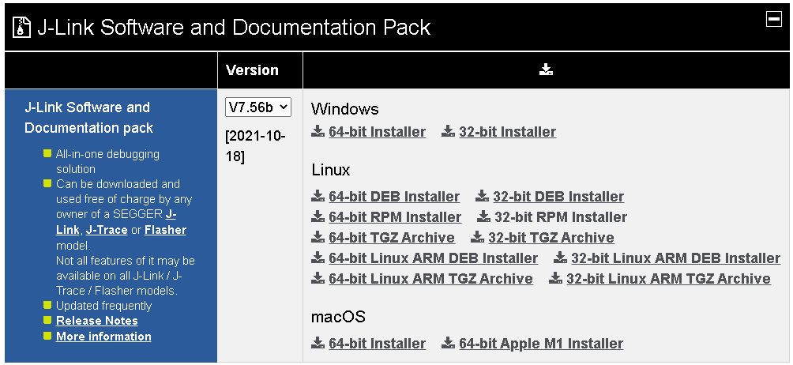
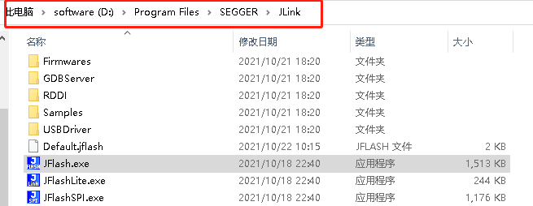
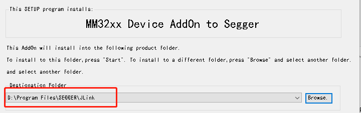
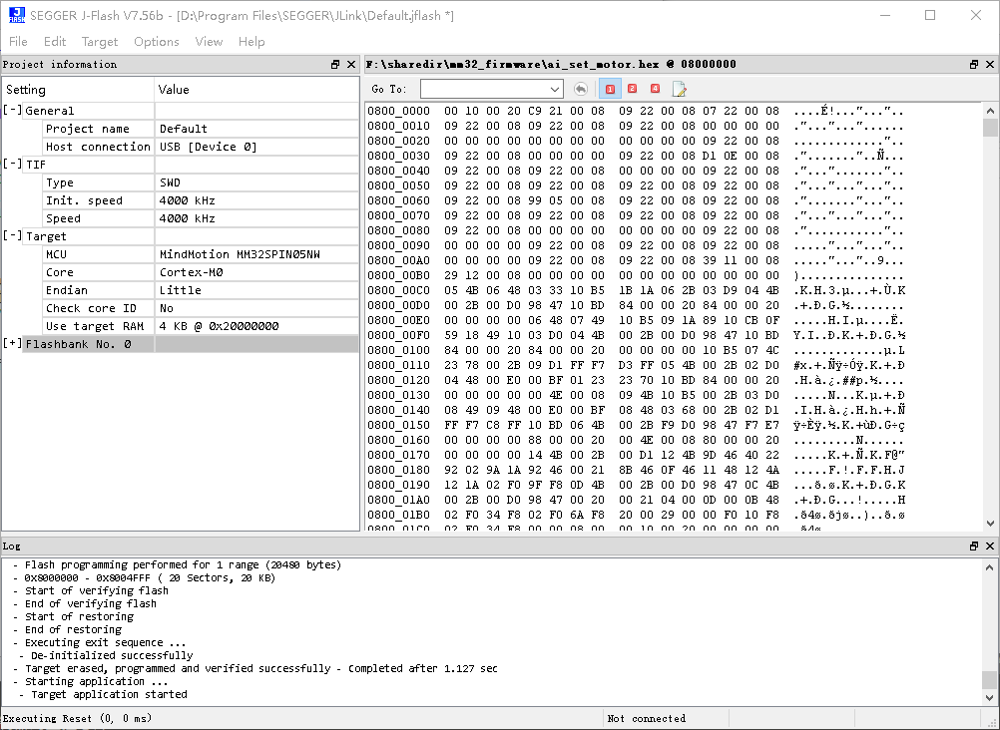

# 编译环境安装(以下是ubuntu上的示例)

- git 下载项目工程 `git clone https://github.com/YanMinge/mm32_project_demo`

- 下载最新的 gcc开发环境 `sudo apt-get install sudo apt-get install gcc-arm-none-eabi`

- 默认gcc会安装在usr目录, 现在可以执行编译程序
    `./compile.sh`

- 如果没异常的话，会在build目录中生成.bin和.HEX文件

# 下载程序

- 下载最新的 SEGGER Jlink软件，[点击下载](https://www.segger.com/downloads/jlink "jlink下载") 。

根据自己的系统选择合适的版本进行安装。(ubuntu中选择 DEB Install进行安装)

- 找到安装目录，windows和ubuntu的默认安装路径去找(ubuntu系统默认安装在`/opt/ `目录中 )

- 添加 MM32的 package支持，在示例中，我修改的版本是2021年10月22最新的release版本V7.56b， package包在 `mm32_project_demo/doc/MM32_PACKAGE_Segger.rar`，解压压缩包。

- 在windows中，点击 MM32_PACKAGE_Segger.exe，选择 Jlink的安装路径，如下图

应设置为:

- 在linux系统中或者macos系统中，可以手动复制 `MM32_PACKAGE_Segger\PackageFiles\JLinkDevices.xml` 覆盖到安装目录的对应位置，例如ubuntu系统的 `/opt/SEGGER/JLink/JLinkDevices.xml`, 复制的时候如果是使用管理员权限复制，复制后，需要用 `sudo chmod 777 /opt/SEGGER/JLink/JLinkDevices.xml`修改权限

- 同时，复制 `MM32_PACKAGE_Segger\PackageFiles\Devices\MindMotion` 文件夹到安装目录的对应位置，例如ubuntu系统的 `/opt/SEGGER/JLink/Devices/` 的目录内。复制的时候如果是使用管理员权限复制，复制后，需要用 `sudo chmod 777 -R /opt/SEGGER/JLink/Devices/MindMotion` 修改权限

- 接好jlink和开发板，应当可以连接上设备，并进行程序烧录

